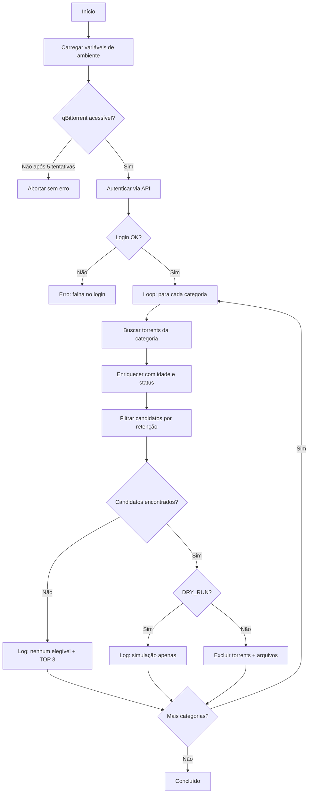

# qbit-autodelete


Script Bash para **automação de exclusão de torrents** no qBittorrent, com regras de retenção por categoria, via API WebUI.

---

## Índice

- [Visão Geral](#visão-geral)
- [Como Funciona](#como-funciona)
- [Funcionalidades](#funcionalidades)
- [Requisitos e Dependências](#requisitos-e-dependências)
- [Instalação Passo a Passo](#instalação-passo-a-passo)
  - [1. Instalar pacotes necessários](#1-instalar-pacotes-necessários)
  - [2. Criar estrutura de pastas](#2-criar-estrutura-de-pastas)
  - [3. Instalar o script](#3-instalar-o-script)
  - [4. Criar arquivo de variáveis de ambiente](#4-criar-arquivo-de-variáveis-de-ambiente)
- [Variáveis de Ambiente](#variáveis-de-ambiente)
- [Configuração de Categorias](#configuração-de-categorias)
- [Testes Manuais](#testes-manuais)
- [Serviços systemd](#serviços-systemd)
  - [Criar o serviço (oneshot)](#criar-o-serviço-oneshot)
  - [Criar o timer (agendamento)](#criar-o-timer-agendamento)
  - [Ativar e validar](#ativar-e-validar)
- [Exemplo de Saída](#exemplo-de-saída)
- [Aliases Úteis](#aliases-úteis)
- [Segurança](#segurança)
- [Solução de Problemas](#solução-de-problemas)
- [Desinstalação](#desinstalação)
- [Boas Práticas e Dicas](#boas-práticas-e-dicas)
- [Checklist Final](#checklist-final)
- [Licença](#licença)

---

## Visão Geral

O `qbit-autodelete.sh` automatiza a remoção de torrents no qBittorrent com base em **regras de retenção por categoria** (em horas).

### Fluxo de execução

1. Lê variáveis de ambiente (URL do qBittorrent, credenciais e flags de operação).
2. Aguarda o qBittorrent responder na API (até 5 tentativas).
3. Autentica na WebUI/API via cookie de sessão.
4. Para cada categoria configurada, calcula a idade dos torrents e identifica os elegíveis para exclusão.
5. Remove torrents elegíveis conforme regras (respeitando `DRY_RUN`, limites e segurança).
6. Escreve logs detalhados e um resumo de execução.

---

## Como Funciona



---

## Funcionalidades

| Recurso | Descrição |
|---------|-----------|
| **Retenção por categoria** | Cada categoria tem seu próprio tempo de retenção em horas |
| **DRY_RUN** | Modo simulação — mostra o que seria deletado sem executar |
| **Proteção contra incompletos** | Por padrão, só deleta torrents 100% completos |
| **Limite por execução** | `MAX_DELETE_PER_RUN` evita exclusões em massa acidentais |
| **Retry automático** | Reconexão automática à API em caso de falha |
| **Cookie seguro** | Cookie temporário com cleanup automático via `trap` |
| **Sem categoria** | Suporte opcional para torrents sem categoria atribuída |
| **Logs detalhados** | Resumo por categoria, TOP 3 mais antigos, contadores |

---

## Requisitos e Dependências

### Sistema operacional

- **Debian/Ubuntu** (ou qualquer distribuição Linux com systemd)

### Pacotes necessários

| Pacote | Uso |
|--------|-----|
| `curl` | Comunicação com a API do qBittorrent |
| `jq` | Parsing e manipulação de JSON |
| `ca-certificates` | Certificados TLS (necessário para HTTPS) |
| `coreutils` | Comandos `date`, `awk`, `sed` (geralmente já instalados) |

### Requisitos do qBittorrent

- **WebUI habilitada** com API acessível localmente
- Credenciais de acesso (usuário e senha)
- Porta da WebUI configurada e acessível via `127.0.0.1`

---

## Instalação Passo a Passo

### 1. Instalar pacotes necessários

```bash
sudo apt update
sudo apt install -y curl jq ca-certificates
```

### 2. Criar estrutura de pastas

Crie os diretórios para o script e logs, substituindo `SEU_USUARIO` pelo seu nome de usuário no sistema:

```bash
mkdir -p /home/SEU_USUARIO/scripts
mkdir -p /home/SEU_USUARIO/logs
sudo chown -R SEU_USUARIO:SEU_USUARIO /home/SEU_USUARIO/scripts /home/SEU_USUARIO/logs
```

### 3. Instalar o script

Copie o arquivo `qbit-autodelete.sh` para o diretório de scripts:

```bash
cp qbit-autodelete.sh /home/SEU_USUARIO/scripts/qbit-autodelete.sh
chmod +x /home/SEU_USUARIO/scripts/qbit-autodelete.sh
sudo chown SEU_USUARIO:SEU_USUARIO /home/SEU_USUARIO/scripts/qbit-autodelete.sh
```

### 4. Criar arquivo de variáveis de ambiente

Este arquivo centraliza toda a configuração e credenciais, mantendo-os **fora do script**.

> **📁 Template pronto:** [`templates/qbit_autodelete.env`](templates/qbit_autodelete.env)

Copie o template e ajuste os valores:

```bash
sudo cp templates/qbit_autodelete.env /etc/qbit_autodelete.env
sudo nano /etc/qbit_autodelete.env
```

Ou crie manualmente com o conteúdo abaixo:

```bash
# URL da WebUI/API do qBittorrent (usar localhost)
QBT_URL="http://127.0.0.1:PORTA_QBITTORRENT"

# Credenciais da WebUI do qBittorrent
QBT_USER="SEU_USUARIO"
QBT_PASS="SUA_SENHA_AQUI"

# Modo de operação
DRY_RUN="false"                  # true = simula sem apagar | false = executa exclusões
LOG_LEVEL="summary"              # summary = resumo | detailed = lista todos os candidatos
ALLOW_INCOMPLETE_DELETE="false"  # true = deleta incompletos também | false = só completos
MAX_DELETE_PER_RUN="9999"        # limite máximo de exclusões por execução

# Torrents sem categoria (opcional)
INCLUDE_NO_CATEGORY="false"              # true = processa torrents sem categoria
NO_CATEGORY_RETENTION_HOURS="168"        # retenção em horas para sem categoria

# HTTPS self-signed (descomente se necessário)
# CURL_INSECURE="--insecure"
```

Proteja o arquivo com permissões restritas:

```bash
sudo chown root:SEU_USUARIO /etc/qbit_autodelete.env
sudo chmod 640 /etc/qbit_autodelete.env
```

---

## Variáveis de Ambiente

| Variável | Padrão | Descrição |
|----------|--------|-----------|
| `QBT_URL` | `http://127.0.0.1:PORTA` | URL da API do qBittorrent. Use localhost. |
| `QBT_USER` | *(obrigatório)* | Usuário da WebUI do qBittorrent |
| `QBT_PASS` | *(obrigatório)* | Senha da WebUI do qBittorrent |
| `DRY_RUN` | `true` | `true` = simula sem excluir; `false` = exclui de fato |
| `LOG_LEVEL` | `summary` | `summary` = resumo; `detailed` = lista candidatos |
| `ALLOW_INCOMPLETE_DELETE` | `false` | Permitir exclusão de torrents incompletos |
| `MAX_DELETE_PER_RUN` | `100` | Máximo de torrents a excluir por execução |
| `INCLUDE_NO_CATEGORY` | `false` | Processar torrents sem categoria |
| `NO_CATEGORY_RETENTION_HOURS` | `168` | Retenção para torrents sem categoria (horas) |
| `CURL_INSECURE` | *(vazio)* | Definir como `--insecure` para ignorar TLS |

> **⚠️ Importante:** As variáveis `QBT_USER` e `QBT_PASS` são **obrigatórias**. O script aborta automaticamente se não estiverem definidas.

---

## Configuração de Categorias

As categorias e seus tempos de retenção são definidos diretamente no script, no array `RETENTION_HOURS`:

```bash
declare -A RETENTION_HOURS=(
  ["Categoria-1"]=168
  ["Categoria-2"]=168
  ["Categoria-3"]=168
  # ... adicione quantas categorias precisar
)
```

- Os **nomes das categorias** devem corresponder exatamente aos nomes configurados no qBittorrent.
- Os **valores** são em **horas** (ex.: `168` = 7 dias, `72` = 3 dias, `24` = 1 dia).

### Tabela de conversão (referência rápida)

| Horas | Dias |
|-------|------|
| 24 | 1 dia |
| 48 | 2 dias |
| 72 | 3 dias |
| 120 | 5 dias |
| 168 | 7 dias |
| 240 | 10 dias |
| 336 | 14 dias |
| 720 | 30 dias |

---

## Testes Manuais

Antes de configurar o systemd, valide manualmente:

### 1. Verificar se a API responde

```bash
curl -s http://127.0.0.1:PORTA_QBITTORRENT/api/v2/app/version
```

Deve retornar a versão do qBittorrent (ex.: `v5.0.4`).

### 2. Rodar o script manualmente

```bash
source /etc/qbit_autodelete.env
bash /home/SEU_USUARIO/scripts/qbit-autodelete.sh
```

Se aparecer `Login OK.` e a listagem por categorias, o script está funcionando corretamente.

> **💡 Dica:** Para o primeiro teste, mantenha `DRY_RUN="true"` no arquivo `.env` para apenas simular sem excluir.

---

## Serviços systemd

### Criar o serviço (oneshot)

> **📁 Template pronto:** [`templates/qbit-autodelete.service`](templates/qbit-autodelete.service)

Copie o template e ajuste:

```bash
sudo cp templates/qbit-autodelete.service /etc/systemd/system/qbit-autodelete.service
sudo nano /etc/systemd/system/qbit-autodelete.service
```

Ou crie manualmente. Substitua `SEU_USUARIO` pelo seu nome de usuário:

```bash
sudo nano /etc/systemd/system/qbit-autodelete.service
```

```ini
[Unit]
Description=qBittorrent Auto-Delete (oneshot)
Wants=network-online.target
After=network-online.target

[Service]
Type=oneshot
User=SEU_USUARIO
Group=SEU_USUARIO
EnvironmentFile=/etc/qbit_autodelete.env
ExecStart=/home/SEU_USUARIO/scripts/qbit-autodelete.sh
WorkingDirectory=/home/SEU_USUARIO/scripts
StandardOutput=append:/home/SEU_USUARIO/logs/qbit-autodelete.log
StandardError=append:/home/SEU_USUARIO/logs/qbit-autodelete.log
RemainAfterExit=no

[Install]
WantedBy=multi-user.target
```

> **💡 Opcional:** Para vincular ao serviço do qBittorrent, adicione na seção `[Unit]`:
> ```ini
> After=qbittorrent@SEU_USUARIO.service
> Requires=qbittorrent@SEU_USUARIO.service
> ```

---

### Criar o timer (agendamento)

> **📁 Template pronto:** [`templates/qbit-autodelete.timer`](templates/qbit-autodelete.timer)

Copie o template:

```bash
sudo cp templates/qbit-autodelete.timer /etc/systemd/system/qbit-autodelete.timer
```

Ou crie manualmente (execução a cada hora):

```bash
sudo nano /etc/systemd/system/qbit-autodelete.timer
```

```ini
[Unit]
Description=Executa o Auto-Delete do qBittorrent a cada hora

[Timer]
OnCalendar=hourly
Persistent=true
Unit=qbit-autodelete.service

[Install]
WantedBy=timers.target
```

#### Alternativas de agendamento

| Frequência | Valor de `OnCalendar` |
|------------|----------------------|
| A cada hora | `hourly` |
| A cada 30 minutos | `*:0/30` |
| Diariamente às 04:00 | `*-*-* 04:00:00` |
| A cada 6 horas | `*-*-* 00/6:00:00` |
| Duas vezes por dia (04:00 e 16:00) | `*-*-* 04,16:00:00` |

---

### Ativar e validar

```bash
# Recarregar o systemd para reconhecer as novas units
sudo systemctl daemon-reload

# Habilitar e iniciar o timer (persiste após reboot)
sudo systemctl enable --now qbit-autodelete.timer

# Executar o serviço imediatamente (sem esperar o timer)
sudo systemctl start qbit-autodelete.service

# Verificar status do serviço e timer
systemctl status qbit-autodelete.service qbit-autodelete.timer --no-pager

# Listar timers agendados
systemctl list-timers | grep qbit-autodelete

# Ver logs recentes
tail -n 80 /home/SEU_USUARIO/logs/qbit-autodelete.log
```

---

## Exemplo de Saída

Uma execução típica produz a seguinte saída nos logs:

```
[CRON] Executado em Wed Feb 12 13:00:01 UTC 2026
[INFO] Iniciando sessão...
[INFO] Login OK.

========== Categoria: 'Categoria-1' (retenção: 168h) ==========
[INFO] Resumo categoria 'Categoria-1': {"total":8,"completos":8,"elegiveis_por_idade":3}
[INFO] Encontrados 3 candidatos em categoria 'Categoria-1':
[INFO] Excluindo 3 torrents em categoria 'Categoria-1'...
[OK] Exclusão concluída (categoria 'Categoria-1').

========== Categoria: 'Categoria-2' (retenção: 168h) ==========
[INFO] Resumo categoria 'Categoria-2': {"total":5,"completos":5,"elegiveis_por_idade":0}
[INFO] Nenhum torrent atingiu o prazo em categoria 'Categoria-2'.
[INFO] TOP 3 mais antigos em categoria 'Categoria-2':
Ubuntu.24.04.Desktop.ISO	142h
Debian.12.Server.ISO	98h
Fedora.41.Workstation.ISO	67h

[INFO] Concluído.
```

Quando em modo `DRY_RUN="true"`:

```
[INFO] Encontrados 3 candidatos em categoria 'Categoria-1':
[DRY-RUN] Exclusão NÃO executada.
```

---

## Aliases Úteis

Adicione atalhos ao seu terminal para facilitar o dia-a-dia. Substitua `SEU_USUARIO` pelo seu nome de usuário:

```bash
nano ~/.bash_aliases
```

Cole as linhas:

```bash
alias qbit-del-status='systemctl status qbit-autodelete.service qbit-autodelete.timer --no-pager'
alias qbit-del-run='sudo systemctl start qbit-autodelete.service'
alias qbit-del-log='tail -n 80 /home/SEU_USUARIO/logs/qbit-autodelete.log'
```

Recarregue:

```bash
source ~/.bash_aliases
```

---

## Segurança

O script implementa múltiplas camadas de segurança:

| Camada | Mecanismo | Detalhes |
|--------|-----------|----------|
| **Credenciais** | Arquivo `.env` externo | Credenciais ficam fora do script, em `/etc/qbit_autodelete.env` com permissão `640` |
| **Rede** | Conexão local | Usa `127.0.0.1` — sem exposição à rede externa, sem dependência de DNS ou reverse proxy |
| **Cookie** | Temporário com cleanup | Arquivo temporário via `mktemp`, removido automaticamente via `trap EXIT INT TERM` |
| **DRY_RUN** | Ativo por padrão | O script não exclui nada até você explicitamente definir `DRY_RUN="false"` |
| **Incompletos** | Protegidos por padrão | `ALLOW_INCOMPLETE_DELETE="false"` impede exclusão de downloads em andamento |
| **Limite** | `MAX_DELETE_PER_RUN` | Evita exclusões em massa acidentais por execução |
| **Variáveis obrigatórias** | `${VAR:?}` | Script aborta imediatamente se `QBT_USER` ou `QBT_PASS` não estiverem definidas |
| **Falha graceful** | Exit 0 em timeout | Se o qBittorrent não responder, o script encerra sem marcar falha no systemd |

### Recomendações adicionais

- Mantenha o `.env` com `root:SEU_USUARIO` e `chmod 640`
- Nunca coloque credenciais diretamente no script
- Use `DRY_RUN="true"` até validar as regras de retenção
- Revise os logs regularmente: `tail -f /home/SEU_USUARIO/logs/qbit-autodelete.log`

---

## Solução de Problemas

### `[ERRO] Falha no login`

| Causa | Solução |
|-------|---------|
| Credenciais incorretas | Verifique `QBT_USER` e `QBT_PASS` no `.env` |
| WebUI com autenticação desabilitada | Habilite autenticação na WebUI do qBittorrent |
| Proteção anti-brute-force ativa | Aguarde ou reinicie o qBittorrent |

### `qBittorrent ainda não respondeu após 5 tentativas`

| Causa | Solução |
|-------|---------|
| Porta incorreta | Verifique `QBT_URL` — confira a porta na configuração da WebUI |
| qBittorrent parado | `sudo systemctl start qbittorrent` ou equivalente |
| Firewall bloqueando | Verifique se a porta está acessível localmente: `curl -s http://127.0.0.1:PORTA/api/v2/app/version` |

### `comando 'jq' não encontrado`

```bash
sudo apt install -y jq
```

### Script roda mas não deleta nada

| Possível causa | Verificação |
|----------------|-------------|
| Modo simulação ativo | Confirme que `DRY_RUN="false"` no `.env` |
| Limite zerado | Confirme que `MAX_DELETE_PER_RUN` > 0 (recomendado: `9999`) |
| Torrents incompletos | Se os torrents não estão 100%, defina `ALLOW_INCOMPLETE_DELETE="true"` |
| Retenção muito alta | Verifique os valores em `RETENTION_HOURS` no script |

### Logs não aparecem

| Causa | Solução |
|-------|---------|
| Diretório de logs não existe | `mkdir -p /home/SEU_USUARIO/logs` |
| Permissão negada | `sudo chown SEU_USUARIO:SEU_USUARIO /home/SEU_USUARIO/logs` |
| Serviço não rodou | `sudo systemctl start qbit-autodelete.service` e cheque o status |

---

## Desinstalação

Para remover completamente o qbit-autodelete:

```bash
# 1. Parar e desabilitar o timer e serviço
sudo systemctl disable --now qbit-autodelete.timer
sudo systemctl stop qbit-autodelete.service

# 2. Remover units do systemd
sudo rm /etc/systemd/system/qbit-autodelete.service
sudo rm /etc/systemd/system/qbit-autodelete.timer
sudo systemctl daemon-reload

# 3. Remover script e logs
rm /home/SEU_USUARIO/scripts/qbit-autodelete.sh
rm -rf /home/SEU_USUARIO/logs/qbit-autodelete.log

# 4. Remover arquivo de configuração
sudo rm /etc/qbit_autodelete.env

# 5. (Opcional) Remover aliases
# Edite ~/.bash_aliases e remova as linhas qbit-del-*
```

---

## Boas Práticas e Dicas

- **Use URL local** (`127.0.0.1:PORTA`) para evitar dependência de domínio, reverse proxy ou Cloudflare.
- **Primeiro teste com `DRY_RUN="true"`** para validar o comportamento sem risco.
- **Verifique `MAX_DELETE_PER_RUN`** — valor `0` em alguns cenários pode significar "não deletar". Use um valor alto como `9999` para não limitar.
- **Logs do journald** — se não conseguir ler sem `sudo`, use:
  ```bash
  sudo systemctl status qbit-autodelete.service --no-pager
  ```
- **Segurança do `.env`** — O arquivo `/etc/qbit_autodelete.env` contém credenciais. Mantenha permissões `640` com `root:SEU_USUARIO`.

---

## Checklist Final

Valide sua instalação executando estes comandos:

```bash
# 1. API está respondendo?
curl -s http://127.0.0.1:PORTA_QBITTORRENT/api/v2/app/version

# 2. Script roda corretamente?
source /etc/qbit_autodelete.env && bash /home/SEU_USUARIO/scripts/qbit-autodelete.sh

# 3. Timer está agendado?
systemctl list-timers | grep qbit-autodelete

# 4. Logs estão sendo gerados?
tail -n 40 /home/SEU_USUARIO/logs/qbit-autodelete.log
```

Se todos passarem, o **autodelete está 100% operacional**. ✅

---

## Licença

MIT License — use e modifique livremente.
